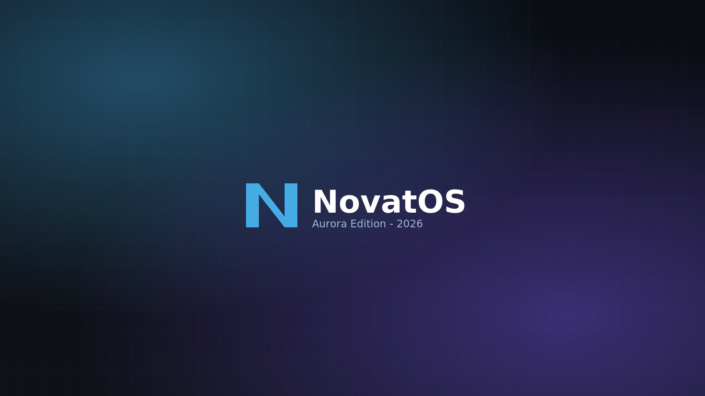

# NovatOS — Aurora Edition 2026

<p align="center">
  
</p>

> A modern, lightweight **Arch Linux**-based distribution featuring **KDE Plasma 6**,
> built for 2026. One-click installs, full GPU support, gaming-ready, BIOS + UEFI hybrid boot.

[](https://github.com/salom600/NovatOS/actions/workflows/build-iso.yml)
[](https://github.com/salom600/NovatOS/releases)
[](LICENSE)

---

## What is NovatOS?

NovatOS is an Arch-based Linux distribution assembled via [`archiso`](https://wiki.archlinux.org/title/Archiso)
and built entirely in **GitHub Actions**. Every push to `main` produces a fresh, bootable ISO
published to the [Releases](https://github.com/salom600/NovatOS/releases) page.

### Highlights

| Feature | Details |
|---|---|
| **Base** | Arch Linux, `linux-zen` kernel (tuned for desktop latency) |
| **Desktop** | KDE Plasma 6 on Wayland (with Xorg fallback) |
| **Display manager** | SDDM with custom NovatOS theme |
| **Installer** | Calamares, NovatOS-branded |
| **App store** | Discover + Flatpak (Flathub) + AUR via `paru` (post-install) |
| **GPU drivers** | Mesa (AMD/Intel) + NVIDIA proprietary + Vulkan ICD loaders, all preinstalled |
| **Gaming** | Steam + Proton + Lutris + Wine + Gamescope + Mangohud |
| **Audio** | PipeWire + WirePlumber (PulseAudio-compatible) |
| **Boot** | GRUB (BIOS + UEFI) hybrid ISO, systemd-boot UEFI fallback |
| **Live USB** | `dd` or Ventoy — same image tests live and installs to disk |
| **Identity** | Custom NovatOS "Aurora" theme: wallpaper, GRUB, SDDM, Calamares branding |

---

## Download & Use

### 1. Download the ISO

Get the latest build from [Releases](https://github.com/salom600/NovatOS/releases).

GitHub Releases has a 2GB-per-asset limit, so the ISO is split into ~1.9GB chunks.
Download ALL `.iso.partNN` files plus the `.sha256sum` and `.README.txt` to one folder.

### 2. Reassemble

```bash
cat novatos-*.iso.part* > novatos-YYYY.MM.DD-x86_64.iso
sha256sum -c novatos-*.sha256sum   # verify integrity
```

### 3. Flash to USB

| OS | Command / Tool |
|---|---|
| Linux | `sudo dd if=novatos-*.iso of=/dev/sdX bs=4M status=progress && sync` |
| Cross-platform | [Ventoy](https://www.ventoy.net) (recommended) |
| Cross-platform | [balenaEtcher](https://etcher.balena.io) |
| Windows | Rufus (**DD mode**, not ISO mode) |

### 4. Boot

Insert the USB, reboot, select **NovatOS Live** from the boot menu.
The live desktop auto-logs in as user `novatos` (password `novatos`).

### 5. Install

From the live desktop, double-click **Install NovatOS**.
This launches the NovatOS-branded `archinstall` wrapper (the official Arch
installer — Calamares was removed from Arch official repos in 2026).

---

## Project Layout

```
NovatOS/
├── .github/workflows/        # CI: build-iso.yml, validate.yml, auto-fix.yml
├── archiso/novatos/          # archiso profile (the heart of the build)
│   ├── profiledef.sh         # ISO metadata, bootmodes, arch
│   ├── pacman.conf           # repos enabled during build
│   ├── packages.x86_64       # package list (what gets installed in the ISO)
│   ├── syslinux/             # BIOS bootloader configs
│   ├── efiboot/              # UEFI (systemd-boot) configs
│   └── airootfs/             # live system root overlay
│       ├── etc/               # system config (hostname, sudoers, calamares/, sddm.conf.d/, …)
│       ├── root/customize_airootfs.sh   # master customization script
│       ├── usr/local/bin/    # NovatOS helper scripts (novatos-welcome, first-run, …)
│       ├── usr/share/calamares/branding/novatos/   # branding PNGs + show.qml
│       ├── usr/share/sddm/themes/novatos/          # SDDM theme
│       ├── boot/grub/themes/novatos/               # GRUB theme
│       └── etc/skel/         # default user home dotfiles (.zshrc, .bashrc, .config/…)
├── scripts/                  # off-target build helpers (generate_branding_assets.py, …)
└── docs/                     # design docs, feature list, build guide
```

---

## Build It Yourself

The ISO builds 100% in GitHub Actions — no local build host required. To trigger a build:

1. Push to `main` (or merge a PR). The **Build ISO** workflow runs.
2. Watch progress in the [Actions tab](https://github.com/salom600/NovatOS/actions).
3. When green, the ISO appears in [Releases](https://github.com/salom600/NovatOS/releases).

To build locally:

```bash
# On an Arch Linux host (or in an archlinux container with --privileged)
sudo pacman -S archiso
sudo mkarchiso -v -w ./build -o ./out archiso/novatos
```

---

## Auto-Fix Loop

If the build fails, the **Auto-fix Build** workflow:

1. Pulls the failed run's logs.
2. Greps for common patterns (missing packages, keyring errors, conflicts).
3. Applies fixes (removes bad packages, refreshes keyring config, etc.).
4. Commits and pushes, which re-triggers the build.
5. Opens an issue if it can't auto-fix.

---

## Tech Stack

- **Base:** Arch Linux + `archiso`
- **Kernel:** `linux-zen` (default), `linux` (fallback)
- **Desktop:** KDE Plasma 6 + SDDM + Wayland
- **Installer:** Calamares
- **Audio:** PipeWire + WirePlumber
- **GPU:** Mesa + NVIDIA proprietary + Vulkan
- **Gaming:** Steam + Proton + Wine + Lutris + Gamescope
- **Boot:** GRUB (BIOS+UEFI) + systemd-boot (UEFI fallback)
- **CI:** GitHub Actions on `archlinux:latest` container

---

## License

GPL-3.0-or-later. See [LICENSE](LICENSE).

The NovatOS Aurora wallpaper, logo, and theme files are released under
CC-BY-SA-4.0.
